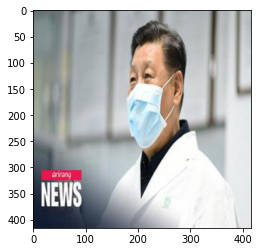
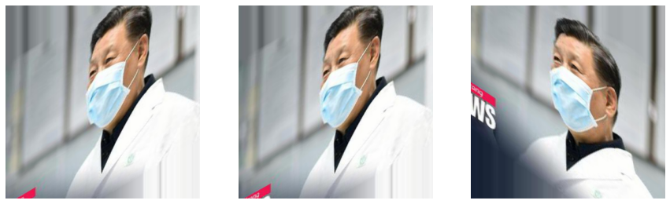
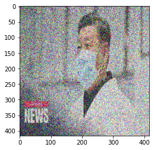

# The Problem
With COVID-19 spreading rapidly, thousands of people are dying each day as there is no effective treatment methods till today and the best form of protection is mask wearing and social distancing. While there are a lot of images online with people wearing mask, annotating a large number of these images is a huge challenge especially a photo with multiple people wearing mask.

# The Solution

## 1. Dataset

Data collection is the biggest challenge of this project - it is not difficult to find sufficient images given the help of readily available webscrapping tools but labelling the data is the most tedious part. Fortunately, we do not need to build the labeling tool from scratch! There are several tools out there but the one I used for this project was labelImg which provides a really simple user interface for labeling. You can find a copy of it here: https://github.com/tzutalin/labelImg

Installation steps are provided in within labelImg's GitHub repository. I was using a Windows machine with Anaconda installed thus, the option I chose was "Windows + Anaconda" which I felt was the easiest and most stable way to launch the application. As we are dealing with the YOLO architecture, do remember to save your labels as the YOLO format.

### Important: 
1. You need to save all the individual `annotations.txt` files into a single text file. The code is provided in this repository as well as a separate Python file.
2. Should you have a readily available dataset but is annotated in the COCO format, you can check out my GitHub Repo for codes to convert your annotations to YOLO's format here: https://github.com/qwirky-yuzu/COCO-to-YOLO.git

As I did not have enough images (labeling was too tedious), I applied a few data augmentation technique to expand my dataset. The data augmentation done were:
1. Shearing
2. Noise addition
3. Rotation

#### Original Image

#### Shearing

#### Rotation

#### Noising

## 2. Model

With more updates on the new YOLO based models, training these models are relatively easy as most of the models' architectures being pre-built and requires only a few tweaks for us to trained a custom model.

Given that there are multiple YoloV5 models available, I attempted to train on increasingly complex models to verify if there is indeed improve in performance. The models used are as follow:
1. YoloV5s without pretrained weights
2. YoloV5s with pretrained weights
3. YoloV5m with pretrained weights
4. Ensemble model with YoloV5s and YoloV5m

## 3. Results:
1. YoloV5s without pretrained weights had the worst result, the model was unable to detect a large amount of mask and did terribly with low resolution images where the masks overlaps with the background.
2. YoloV5s with pretrained weights worked relatively well but missed out a few masks, especially those with patterns but was able to detect regular surgical masks relatively well.
3. YoloV5m with pretrained weights was able to detect masks with patterns but missed out on some surgical masks.
4. YoloV5s and YoloV5m ensemble outperformed any single model as it managed to harness the strengths of both models and managed to detect both surgical masks and mask with patterns.

Given the limited size of the dataset (trained only on 1392 images), results were not fantastic but this provides a relatively solid baseline model that will definitely do better with more data.

